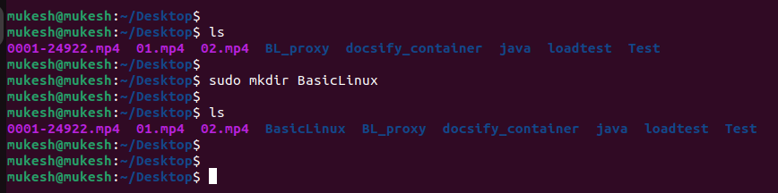
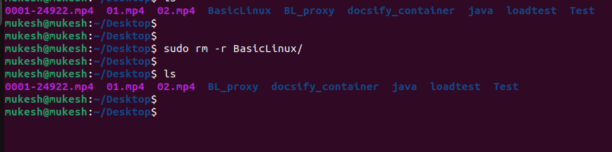
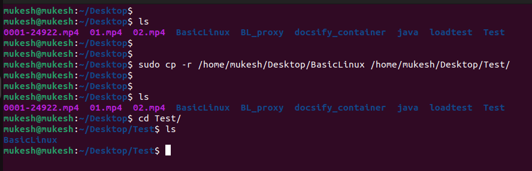
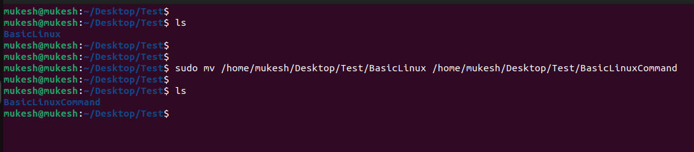
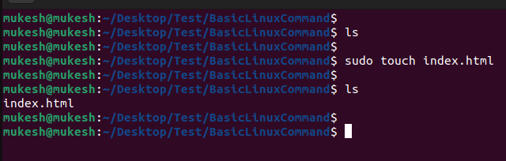
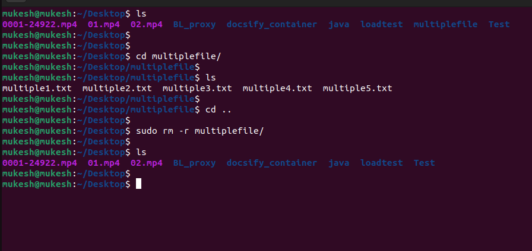
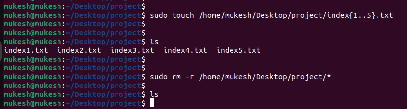

# 
LINUX Assignment 1
 
************************************************************************
# Table of Contents

* [Create directory](#step-1--create-directory)

* [Remove a directory](#step2--remove-a-directory)

* [Make a copy of a file](#step3-make-a-copy-of-a-file)

* [Move or rename a file](#step4-move-or-rename-a-file)

* [Create an empty file](#step5-create-an-empty-file)

* [Remove multiple files with a single command](#step6-remove-multiple-files-with-a-single-command)

* [Remove content from the folder without removing folder](#step7-create-multiple-foldersa-z-with-a-single-command)

* [Create multiple folder(a-z) with a single command](#step8-remove-content-from-the-folder-without-removing-folder)

## Step 1:- Create directory

~~~
sudo mkdir BasicLinux
~~~

**Output**

~~~
mukesh@mukesh:~/Desktop$ ls
0001-24922.mp4  01.mp4  02.mp4  BasicLinux  BL_proxy  docsify_container  java  loadtest  Test
mukesh@mukesh:~/Desktop$ 
~~~

**sudo:** This is a command that stands for "superuser do" and is used to execute commands with elevated privileges.

**mkdir:** This is the command used to create a new directory. It stands for "make directory."

**BasicLinux:** This is the argument or parameter passed to the **mkdir** command.

## Step2:- Remove a directory

~~~
sudo rm -r BasicLinux
~~~

**Output**

~~~
mukesh@mukesh:~/Desktop$ 
mukesh@mukesh:~/Desktop$ sudo rm -r BasicLinux/
mukesh@mukesh:~/Desktop$ 
mukesh@mukesh:~/Desktop$ ls
0001-24922.mp4  01.mp4  02.mp4  BL_proxy  docsify_container  java  loadtest  Test
mukesh@mukesh:~/Desktop$ 
~~~

**rm:** This is the remove command in Linux, used to delete files and directories.

**-r** option, when used with **rm**, enables the removal of directories and their contents by operating recursively.

**BasicLinux:** This is the argument or parameter passed to the rm command.

## Step3:-Make a copy of a file

~~~
sudo cp -r /home/mukesh/Desktop/BasicLinux /home/mukesh/Desktop/Test/
~~~

**Output**
~~~
mukesh@mukesh:~/Desktop$ 
mukesh@mukesh:~/Desktop$ ls
0001-24922.mp4  01.mp4  02.mp4  BasicLinux  BL_proxy  docsify_container  java  loadtest  Test
mukesh@mukesh:~/Desktop$ 
mukesh@mukesh:~/Desktop$ 
mukesh@mukesh:~/Desktop$ sudo cp -r /home/mukesh/Desktop/BasicLinux /home/mukesh/Desktop/Test/
mukesh@mukesh:~/Desktop$ 
mukesh@mukesh:~/Desktop$ 
mukesh@mukesh:~/Desktop$ ls
0001-24922.mp4  01.mp4  02.mp4  BasicLinux  BL_proxy  docsify_container  java  loadtest  Test
mukesh@mukesh:~/Desktop$ cd Test/
mukesh@mukesh:~/Desktop/Test$ ls
BasicLinux
mukesh@mukesh:~/Desktop/Test$ 
~~~

**cp:** This is the copy command in Linux, used to copy files or directories.

**-r:** This option stands for "recursive." When used with cp, it allows the copying of directories and their contents recursively.

**/home/mukesh/Desktop/BasicLinux:** This is the source directory. It specifies the path to the directory you want to copy.

**/home/mukesh/Desktop/Test/:** This is the destination directory. It specifies the location where you want to copy the contents of the source directory.

## Step4:-Move or rename a file

**Output**

~~~
mukesh@mukesh:~/Desktop$ 
mukesh@mukesh:~/Desktop$ ls
0001-24922.mp4  01.mp4  02.mp4  BasicLinux  BL_proxy  docsify_container  java  loadtest  Test
mukesh@mukesh:~/Desktop$ 
mukesh@mukesh:~/Desktop$ sudo mv /home/mukesh/Desktop/BasicLinux /home/mukesh/Desktop/Test/
mukesh@mukesh:~/Desktop$ 
mukesh@mukesh:~/Desktop$ ls
0001-24922.mp4  01.mp4  02.mp4  BL_proxy  docsify_container  java  loadtest  Test
mukesh@mukesh:~/Desktop$ cd Test/
mukesh@mukesh:~/Desktop/Test$ 
mukesh@mukesh:~/Desktop/Test$ ls
BasicLinux
mukesh@mukesh:~/Desktop/Test$ 
mukesh@mukesh:~/Desktop/Test$ ls
BasicLinux
mukesh@mukesh:~/Desktop/Test$ 
mukesh@mukesh:~/Desktop/Test$ sudo mv /home/mukesh/Desktop/Test/BasicLinux /home/mukesh/Desktop/Test/BasicLinuxCommand
mukesh@mukesh:~/Desktop/Test$ 
mukesh@mukesh:~/Desktop/Test$ ls
BasicLinuxCommand
mukesh@mukesh:~/Desktop/Test$ 
~~~

## Step5:-Create an empty file

~~~
sudo touch index.html
~~~

**Output**

~~~
mukesh@mukesh:~/Desktop/Test/BasicLinuxCommand$ 
mukesh@mukesh:~/Desktop/Test/BasicLinuxCommand$ ls
mukesh@mukesh:~/Desktop/Test/BasicLinuxCommand$ 
mukesh@mukesh:~/Desktop/Test/BasicLinuxCommand$ sudo touch index.html
mukesh@mukesh:~/Desktop/Test/BasicLinuxCommand$ 
mukesh@mukesh:~/Desktop/Test/BasicLinuxCommand$ ls
index.html
mukesh@mukesh:~/Desktop/Test/BasicLinuxCommand$ 
~~~

## Step6:-Remove multiple files with a single command

~~~
sudo rm -r multiplefile/
~~~

**Output**
~~~
mukesh@mukesh:~/Desktop$ ls
0001-24922.mp4  01.mp4  02.mp4  BL_proxy  docsify_container  java  loadtest  multiplefile  Test
mukesh@mukesh:~/Desktop$ 
mukesh@mukesh:~/Desktop$ 
mukesh@mukesh:~/Desktop$ cd multiplefile/
mukesh@mukesh:~/Desktop/multiplefile$ 
mukesh@mukesh:~/Desktop/multiplefile$ ls
multiple1.txt  multiple2.txt  multiple3.txt  multiple4.txt  multiple5.txt
mukesh@mukesh:~/Desktop/multiplefile$ 
mukesh@mukesh:~/Desktop/multiplefile$ cd ..
mukesh@mukesh:~/Desktop$ 
mukesh@mukesh:~/Desktop$ sudo rm -r multiplefile/
mukesh@mukesh:~/Desktop$ 
mukesh@mukesh:~/Desktop$ ls
0001-24922.mp4  01.mp4  02.mp4  BL_proxy  docsify_container  java  loadtest  Test
mukesh@mukesh:~/Desktop$ 
mukesh@mukesh:~/Desktop$ 
~~~~

## Step7:-Create multiple folders(a-z) with a single command.

~~~
sudo mkdir /home/mukesh/Desktop/multiplefolder/{A..Z}
~~~

**Output**
~~~
mukesh@mukesh:~/Desktop$ 
mukesh@mukesh:~/Desktop$ 
mukesh@mukesh:~/Desktop$ 
mukesh@mukesh:~/Desktop$ ls
0001-24922.mp4  01.mp4  02.mp4  BL_proxy  docsify_container  java  loadtest  Test
mukesh@mukesh:~/Desktop$ 
mukesh@mukesh:~/Desktop$ 
mukesh@mukesh:~/Desktop$ sudo mkdir multiplefolder
mukesh@mukesh:~/Desktop$ 
mukesh@mukesh:~/Desktop$ ls
0001-24922.mp4  01.mp4  02.mp4  BL_proxy  docsify_container  java  loadtest  multiplefolder  Test
mukesh@mukesh:~/Desktop$ cd multiplefolder/
mukesh@mukesh:~/Desktop/multiplefolder$ ls
mukesh@mukesh:~/Desktop/multiplefolder$ 
mukesh@mukesh:~/Desktop/multiplefolder$ sudo mkdir /home/mukesh/Desktop/multiplefolder/{A..Z}
mukesh@mukesh:~/Desktop/multiplefolder$ 
mukesh@mukesh:~/Desktop/multiplefolder$ ls
A  B  C  D  E  F  G  H  I  J  K  L  M  N  O  P  Q  R  S  T  U  V  W  X  Y  Z
mukesh@mukesh:~/Desktop/multiplefolder$ 

~~~

### Step8:-Remove content from the folder without removing folder

~~~
sudo rm -r /home/mukesh/Desktop/project/*
~~~

**Output**

~~~
mukesh@mukesh:~/Desktop/project$ sudo touch /home/mukesh/Desktop/project/index{1..5}.txt
mukesh@mukesh:~/Desktop/project$ 
mukesh@mukesh:~/Desktop/project$ 
mukesh@mukesh:~/Desktop/project$ ls
index1.txt  index2.txt  index3.txt  index4.txt  index5.txt
mukesh@mukesh:~/Desktop/project$ 
mukesh@mukesh:~/Desktop/project$ 
mukesh@mukesh:~/Desktop/project$ sudo rm -r /home/mukesh/Desktop/project/*
mukesh@mukesh:~/Desktop/project$ 
mukesh@mukesh:~/Desktop/project$ ls
mukesh@mukesh:~/Desktop/project$ 
~~~

**rm:** This is the remove command.

**-r:** This option stands for "recursive," allowing the removal of directories and their contents.

**/home/mukesh/Desktop/project/*:** This specifies the path to the directory whose contents you want to remove. The * is a wildcard character that matches all files and subdirectories in the "project" directory.

